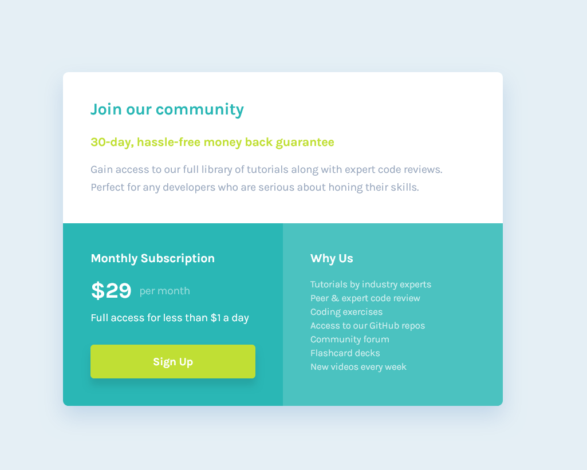

# Frontend Mentor - Single price grid component solution

This is a solution to the [Single price grid component challenge on Frontend Mentor](https://www.frontendmentor.io/challenges/single-price-grid-component-5ce41129d0ff452fec5abbbc). Frontend Mentor challenges help you improve your coding skills by building realistic projects.

## Color Reference

| Color         | Hex                                                              |
| ------------- | ---------------------------------------------------------------- |
| Cyan          |  #2ab7b5 |
| Bright Yellow |  #c0df34 |
| Light Gray    |  #e5eff5 |
| Grayish Blue  |  #98a7bd |

## Table of contents

- [Overview](#overview)
  - [The challenge](#the-challenge)
  - [Screenshot](#screenshot)
  - [Links](#links)
- [My process](#my-process)
  - [Built with](#built-with)
  - [What I learned](#what-i-learned)
  - [Continued development](#continued-development)
  - [Useful resources](#useful-resources)
- [Author](#author)
- [Acknowledgments](#acknowledgments)

## Overview

### The challenge Completed

Users should be able to:

- View the optimal layout for the component depending on their device's screen size
- See a hover state on desktop for the Sign Up call-to-action

### Screenshot

#### Mobile View

#### Desktop View

### Links

- Solution URL: [https://github.com/SauravFrontendDev/Single_price_grid_component](https://github.com/SauravFrontendDev/Single_price_grid_component)
- Live Site URL: [https://fem-saurav-price-grid.netlify.app/](https://fem-saurav-price-grid.netlify.app/)

## My process

### Built with

- Semantic HTML5 markup
- CSS custom properties
- Flexbox
- CSS Grid
- Mobile-first workflow
- Vite

## Author

- Github - [SauravFrontendDev](https://github.com/SauravFrontendDev)
- Linkedin - [/in/saurav-dev/](https://www.linkedin.com/in/saurav-dev/)
- Frontend Mentor - [@Saurav-98](https://www.frontendmentor.io/profile/Saurav-98)
- Twitter - [@SauravKverma22](https://twitter.com/SauravKverma22)
